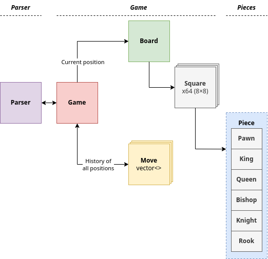

# CHESS-CORE

 

The [chess-core](https://github.com/Theodore-Bardy/chess-core) project is a tool which allows to review, work and study your chess games for free, developed in C++.

This project implement:
 - A full chess game, with the normal behavior and logic.
 - A parser able to read and save chess games at the PGN format.

## Development tools

 - CMake (>= 3.19)
    - `sudo apt install cmake`
 - make
    - `sudo apt install make`
 - gcc/g++ toolchain
    - `sudo apt install build-essential`

## TODO

- [ ] Add doxygen documentation
- [ ] Increase code coverage with unit tests
- [ ] Finish PGN parser
- [ ] Implement a TUI (Terminal User Interface)
    - [C++ FTXUI](https://github.com/ArthurSonzogni/FTXUI)
    - [Rust tui](https://docs.rs/tui/latest/tui/)
- [ ] Add the notion of defended square for the king, for example the king must check mate and not just check:
- [ ] In case the king is currently check, the move msut remove the flag. Otherwise it's an illegal move.
- [ ] Rework the classes dependencies. Especially between board → square → piece.

## Project description

